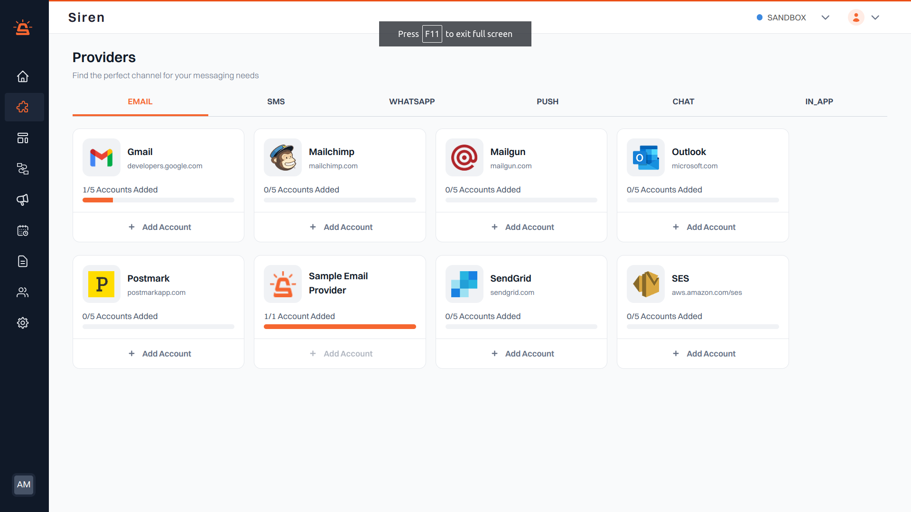
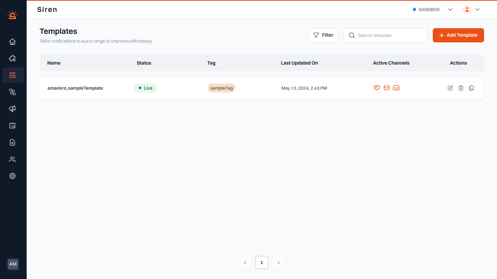
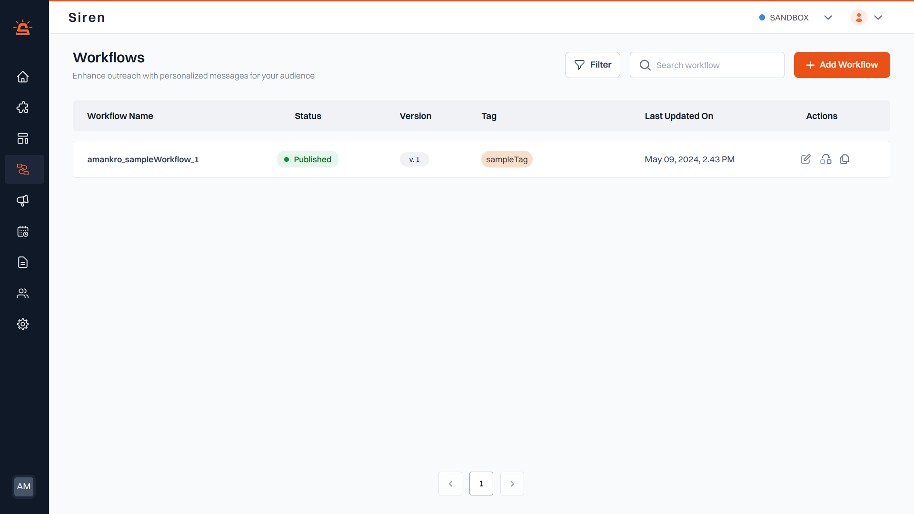

This guide will walk you through the process of sending your first notification using Siren's default setup. By following these steps, you'll be able to explore Siren's features and functionalities quickly.

>**_Prerequisites:_** Before you begin, make sure you have completed the sign-up process for **Siren** and have access to your organization's dashboard.


## Step 1: Accessing Default Configuration



Upon registration, Siren automatically sets up a default provider, template, and workflow for your organization. Here's how you can access them:

1. Log in to your Siren dashboard using your credentials.
2. Navigate to the **"Providers"** section.  
   - You'll find a default provider named `organisationName_sampleProvider` already created for you.  
   - **Note:** The default provider allows you to send up to **50 transactions** per organization.
3. Go to the **"Templates"** section.  
   - Here, you'll see a sample template named `organisationName_sampleTemplate` pre-configured for you.  
   - **Note:** The sample template contains a default subject line:
     ```
     "Welcome to Siren"
     ```
     and message content:
     ```
     "Hi {userName}, This is a sample email triggered using Siren."
     ```  
     You can customize it according to your preferences.
4. Visit the **"Workflows"** section.  
   - You'll find a sample workflow named `organisationName_sampleWorkflow_1` already set up for you.  
   - **Note:** The sample workflow is structured to trigger an email notification using the sample template.

---

## Step 2: Customizing Template and Workflow (Optional)






While the default configuration is ready to use, you can customize the template and workflow according to your specific requirements:

- **Template Customization:**  
  Edit the sample template's content, subject line, or design to match your brand's voice and style.  
  You can also create new templates for different communication channels.

- **Workflow Customization:**  
  Modify the sample workflow's structure, add additional steps, or integrate with other channels to suit your workflow automation needs.

---

## Step 3: Sending Your First Notification

Once you've reviewed and customized the default configuration (if necessary), you can send your first notification using Siren:

1. Navigate to the **"Workflows"** section of your dashboard.
2. Locate the sample workflow `organisationName_sampleWorkflow_1` and select it.
3. Choose the desired mode:
   - TEST mode or
   - Trigger via API
4. Follow the prompts to provide input data (e.g., organization owner's name and email).
5. Confirm and trigger the workflow.

---

🎉 Congratulations! You've successfully sent your first notification using Siren.

You can track the progress and performance of your notifications through the dashboard's **analytics** and **monitoring** features.

Happy notifying with Siren! 🚀🔔
