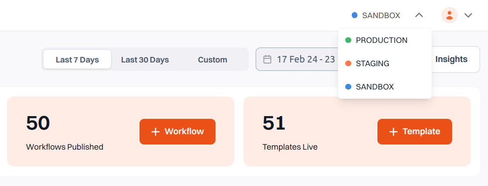

# Workspaces Overview

**Workspaces** are isolated environments within Siren designed to keep disassociated communications contained and easier to manage.

By default, Siren provides three Workspaces:
- **Sandbox**
- **Staging**
- **Production**

## Key Characteristics of Workspaces

- Each workspace has its own:
  - **Templates**
  - **Vendor settings**
  - **Workflows**

- **Organization settings** are common across all workspaces.

> **Note:**  
> Each Workspace has its own **Workspace API Key**, which can be copied from the **API Keys** section in the **Configuration** page.
