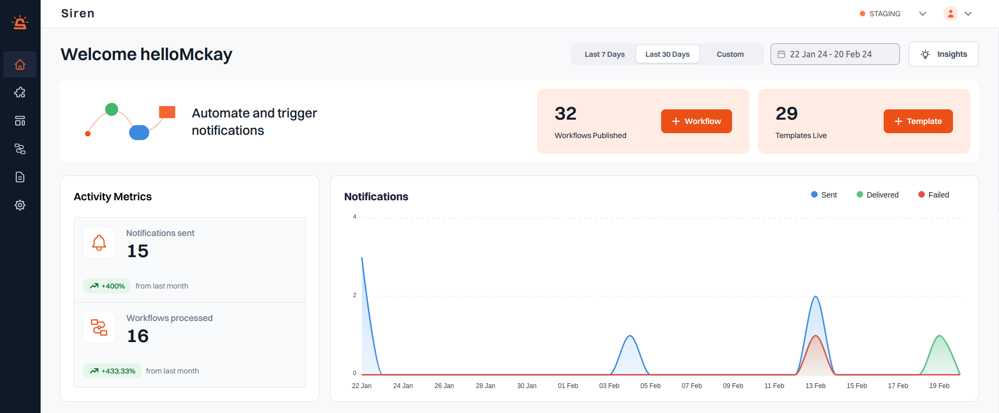
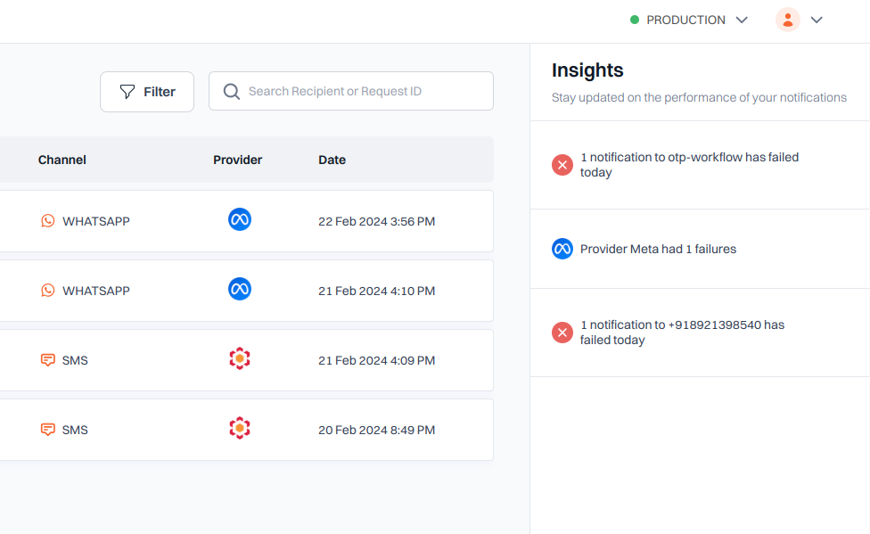
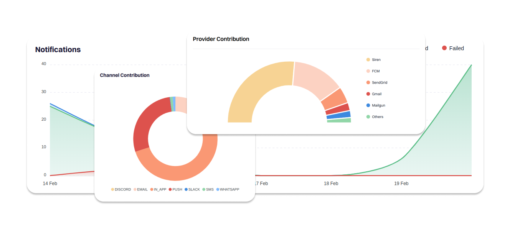

Gain valuable insights into your notification performance with our intuitive dashboard.

---

## Filters

- **Time Filter**:  
  Select from predefined ranges like **Last 7 days**, **28 days**, or **customize the date range** to focus on specific periods relevant to your analysis.

- **Version Filter**:  
  Easily switch between **Live** and **Test** versions to view data specific to your current testing or production environment.

## Overview and Insights

- Get a comprehensive overview of your account's performance in the Insights section.
- Track essential metrics such as:
  - Total Notifications Sent
  - Workflows Processed
  - Channel Performance

## Visualizations

- Channel Engagement: Visualize engagement levels across different channels, offering insights into audience interaction.
- Delivery Status: Monitor the overall delivery status of your notifications across various channels, ensuring effective message dissemination.
- Provider Performance: Evaluate the performance of your providers in terms of delivery efficiency, facilitating informed decision-making.
- Activity Trends: Track usage trends for channels or integrations over time, enabling you to identify patterns and optimize resource allocation.
- Top Events: Identify the most frequently triggered Notification Events, enabling you to prioritize and optimize messaging strategies accordingly.

With Siren's Dashboard, monitoring and optimizing your notification performance has never been more efficient. Dive in and unlock the full potential of your communication strategy with ease!