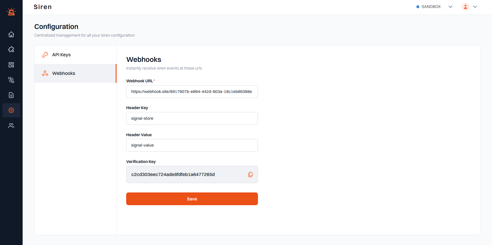

# Webhook Overview

Webhooks in siren enable seamless incorporation of notification event data from Siren into your application. With Siren's standardized data processing, you can eliminate the need for adapting your system to different vendor data structures.

## How it works

Siren promptly sends a JSON payload to your specified endpoint (URL) whenever a notification update occurs, such as message sending, delivery, user interaction, or replies. Once received, Siren triggers a POST request to your designated endpoint, empowering you to store information or initiate specific actions within your application.