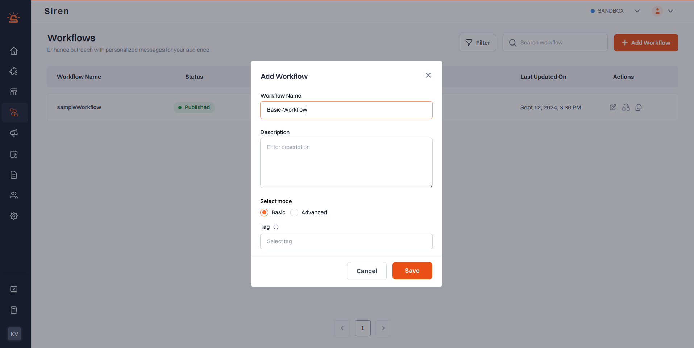
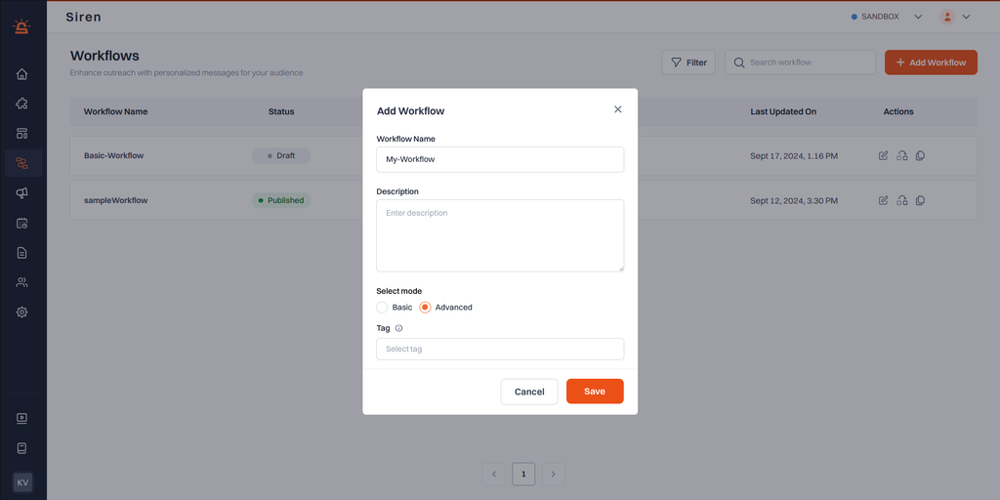
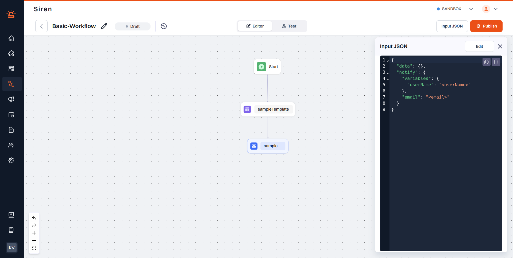
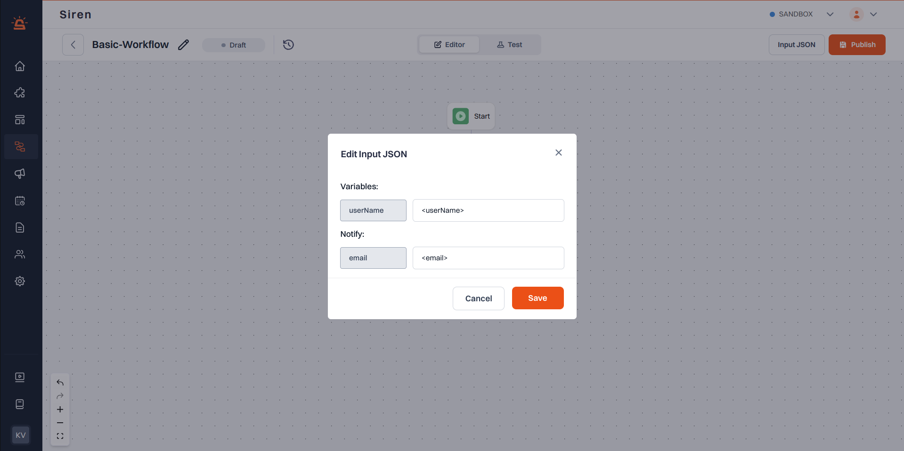

- From the left panel, go to **Workflows > My Workflows**

- Click **+Add Workflow** on the workflow page. In the modal box, provide Workflow Name, Description and category.

- In the **Select mode** section choose **Basic** or **Advanced** if you want to create a Basic Workflow or Advanced workflow respectively.

:::note  When to Use Basic vs Advanced Workflows

**Basic Workflows**  
**Features:**  
- Predefined structure for quick setup  
- Minimal configuration  
- JSON values editable; variables fixed  
**Use Case:** Great for simple, repeatable campaigns like daily updates or announcements.

**Advanced Workflows**  
**Features:**  
- Fully flexible and customizable logic  
- Supports HTTP nodes and external data  
- Full control over structure, values, and variables  
**Use Case:** Ideal for transactional flows, conditional automation, and third-party integrations.

:::

- Add your desired [nodes](03%20-%20Design%20Workflow%20logic.md). The input JSON will be automatically updated with the corresponding structure.

- By clicking the edit button in the **Input JSON** section, you can customize the workflow by editing the placeholders in the generated JSON with your actual values.

- [Test your Workflow](04%20-%20Test%20&%20Trigger.md) before publishing.