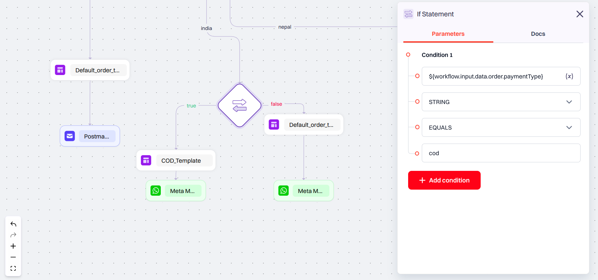
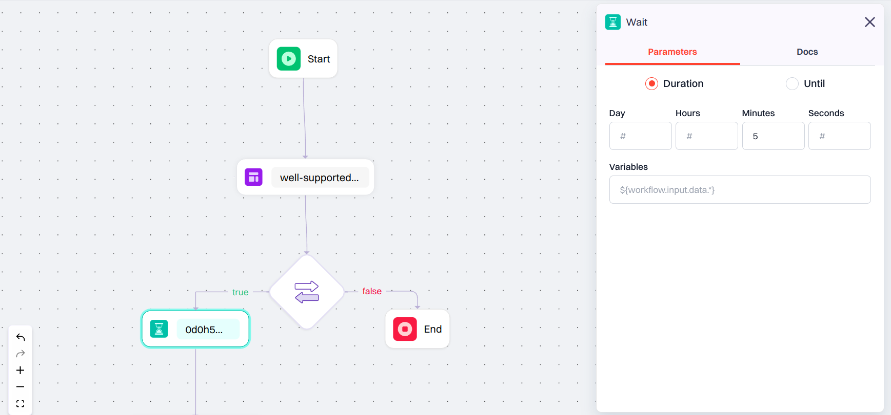
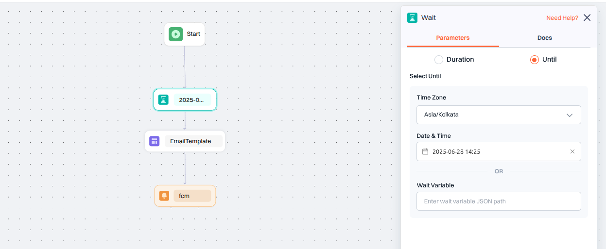
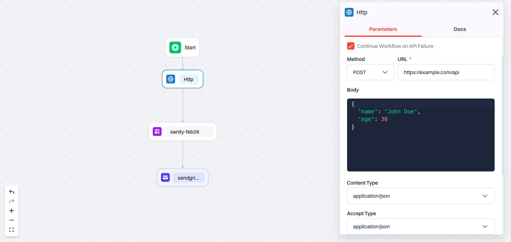
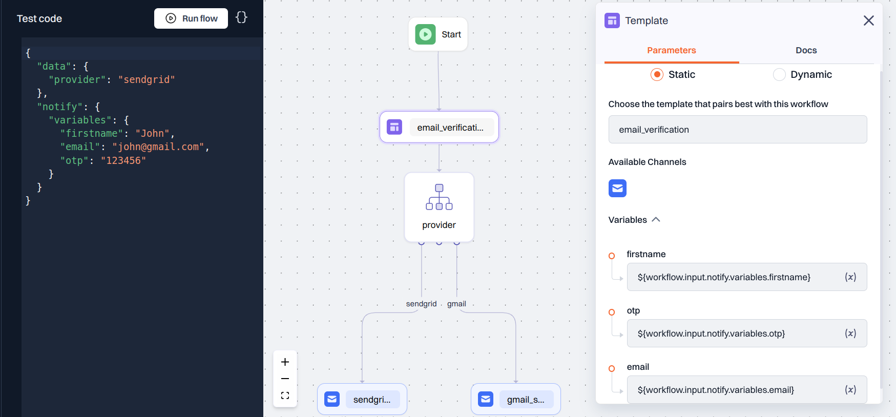
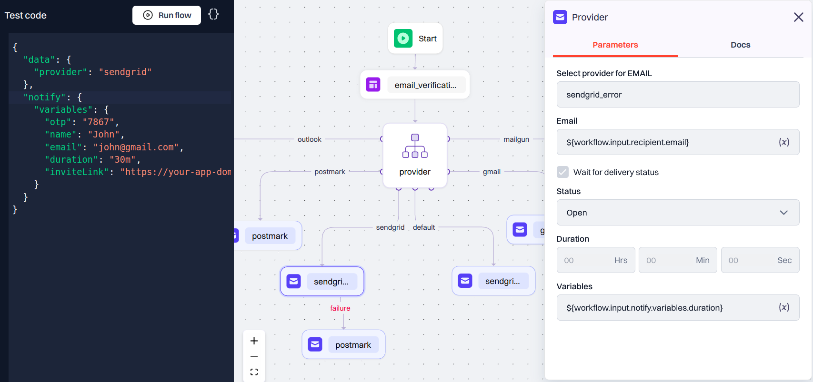

## Working with Nodes


---
## CONTROLS Configuration

### Switch Statement
The switch statement facilitates conditional branching based on the value of a specified input parameter.

#### Input Parameter
Ensure the input parameter for the switch statement is a variable path, prefixed with `$` to reference the appropriate path from the request JSON or HTTP node response.

#### Cases Handling
The switch statement supports up to 9 cases, including the default case.  
If the number of cases exceeds 9, consider extending the default case to another switch statement for better organization.


:::note
Structuring the switch statement efficiently is crucial for clear and concise handling of each case, ensuring the integrity of your workflow.
:::


### If Statement
The if statement enables conditional execution of code based on specified conditions.

#### Usage
Define conditions using the following components:
- **Condition Path**: The path to the variable in the JSON data or HTTP node response.  
- **Variable Type**: Specify the type of variable being evaluated (e.g., string, number, boolean).  
- **Operation**: Define the comparison operation to be performed (e.g., equals, greater than, less than).  
- **Value**: Provide the value to be compared against the variable.  

Multiple conditions can be coupled using `and` and `or` operators.

If the condition evaluates to true, the path marked as true will be executed; otherwise, the false path will be executed.


:::note
Utilize if statements judiciously, ensuring accurate condition setup and clear execution paths to maintain the logic flow of your workflow.
:::

---
## Add Chat Node

---
## Add Wait Node

### Description
The wait node allows for pausing the workflow execution for a specific duration proceeding further.

### Configuration Setup

#### Parameters
**Duration:** Specify the duration for which the workflow should wait before proceeding. The duration can be set statically or passed dynamically through a variable path from the request JSON or HTTP node response.

    - **Static Duration:** Input the duration directly in the format **"dd hh mm ss"** for days, hours, minutes, and seconds. For example, to wait for 2 days, 3 hours, 15 minutes, and 30 seconds, input "02 03 15 30".

    - **Variable Path:** Provide the duration dynamically by specifying a variable path. Ensure the variable is properly formatted and accesible within the workflow.

**Until:** Set the wait node to pause execution until a specific date and time. Input the target date and time in the desired format. Ensure the provided date and time are valid and properly formatted.

### Example
**Static Duration:** Suppose you want to wait for 5 minutes before proceeding. You can configure the wait node as follows:

- Set the time as "00 00 05 00" (5 minutes)


Suppose you want to pause the execution **until a specific date and time**. You can configure the wait note as follows:

- Select your Time Zone from the dropdown
- Input the date and time in **yyyy-mm-dd HH:MM** format.


:::note
Ensure the duration setup aligns with your workflow requirements, allowing for appropriate pauses in the workflow execution.
:::

---
## Add HTTP Node

:::note
HTTP Node configuration is only available in Advance Workflow. 
:::

### Description
The HTTP node configuration panel provides a comprehensive interface for setting up HTTP requests, facilitating seamless integration with external APIs or services.



### Configuration Setup

**Reference Name:** A non-editable field for identification purposes, aiding in referencing the HTTP node within the workflow.

**Continue Workflow on API Failure:** Toggle this option to specify whether the workflow should continue execution even if the API call fails.

**Method:**
Select the HTTP method from the dropdown menu:
        - `GET`
        - `POST`
        - `PUT`
        - `PATCH`
        - `DELETE`
        - `OPTIONS`
        - `HEAD`

**URL:** Enter the URL for the HTTP request. The field supports variables, URLs, or a combination of both. URL validation is performed in the backend if no variables are present.

**Body:** Utilize the code editor to define the request body, supporting JSON, string, HTML, and variables without any constraints on content.

**Content Type:**
Choose the content type from the dropdown menu:
- `application/json`
- `text/plain`
- `text/html`

**Accept Type:**
Choose the accept type from the dropdown menu:
- `application/json`
- `text/plain`
- `text/html`

**Connection Timeout:**
Define the connection timeout in milliseconds, accepting variables or integers for flexible configuration.

**Read Timeout:**
Define the read timeout in milliseconds, accommodating variables or integers for tailored timeout settings.

**Headers Section:**
Add custom headers using the "Add Header" button. Each header comprises a key-value pair text field, allowing for unlimited header configurations.


### Example
Suppose you need to make a POST request with JSON data to a specific URL. Configure the HTTP node as follows:

**Method**: `POST`  
**URL**: [https://example.com/api](https://example.com/api)  
**Body**:
```json
{
  "name": "John Doe",
  "age": 30
}
```

**Content Type:** `application/json`

**Accept Type:** `application/json`

**Connection Timeout:** 5000 milliseconds

**Read Timeout:** 10000 milliseconds

**Headers:**  
**Header 1:**  
Key: Authorization  
Value: Bearer token123  
**Header 2:**  
Key: Content-Type  
Value: `application/json`

Ensure all parameters are correctly configured to facilitate the desired HTTP request

---
## Add Template & Provider

### Template Configuration
**Selecting a Template:** Choose a template from the available published templates or provide the template name as a variable that aligns best with the requirements of the workflow. For more information on Templates go to Templates section.

**Available Channels:** Once the template is selected from the available published templates, you can view all the channels configured within your templates here. Note that the available channels will be hidden if a variable is provided instead of selecting a template.

**Mapping Template Variables:** Map the template variables to static values or provide the variable object path within the JSON data used to trigger the workflow or the HTTP node response. Ensure that variables are prefixed with `$` to reference the appropriate path from either the request JSON or HTTP node.

#### Example
Shown below is an example of an email verification template featuring variables such as `name`, `email`, and `inviteLink`:



---
### Provider Configuration

- **Select provider for EMAIL:** Choose the service provider for sending your notification.

- **Email:** Enter the recipient's email address. This can be either a static email address or a variable.

- **Delivery status:** Check the box if delivery status has to be tracked, then choose "Delivered","Open" or "Read"
  - **Duration:** Set how long the workflow should wait for the selected delivery status. The duration can be fixed or variables. If the tracked delivery status isn't met within the specified time, the workflow will be marked as failed.

  For example, if the delivery status is set as "Read", the workflow will succeed if the recipient reads the email within the specified duration.

  

  
---
## Apply Conditions