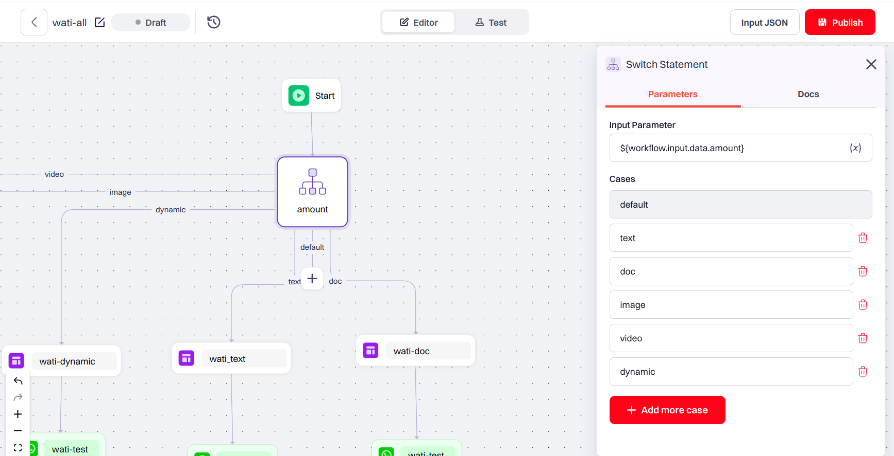

## Working with Nodes

In Siren, **nodes** are the building blocks of a workflow. Each node performs a specific task—such as decision-making, sending messages, waiting, or making API calls—and helps define the logic and flow of the automation. Nodes allow you to control how a workflow behaves based on dynamic inputs, conditions, and external data. 
> Properly configuring each node ensures your workflow behaves predictably and handles all necessary conditions seamlessly.

Following sections explain about different nodes that Siren offer and how to configure them. Once your nodes are configured, you can proceed to <a href="#add-template---provider">adding templates</a> to personalize and deliver your messages.


---
## CONTROLS Configuration

### Switch Node

Use the **Switch Node** when you want to handle multiple possible values for a given input. You define an input parameter, then add different cases under it—each with its own action. At runtime, the node checks the value and routes the workflow to the matching case.
#### Input Parameter

Set the input parameter using a variable path. Prefix it with `${workflow.input}` to reference a value from the incoming request JSON or a previous HTTP node response.  
_Example: `${workflow.input.data.status}`_

#### Handling Cases

- You can define up to **9 cases**, including a **default case**.
- Need more than 9? Use the default case to link to another Switch Node for cleaner handling.



> **💡 Tip:** Keep your switch logic simple and readable. A well-structured Switch Node helps avoid messy branching and keeps your workflow easy to debug.

---

### If Node

Use the **If Node** when you need to make a decision in your workflow — basically, “if this is true, do that; if not, do something else.
#### How to Configure

When setting up an If Node, you’ll define:

- **Condition Path**: The JSON path to the variable you want to check (e.g., `${workflow.input.user.age}`).
- **Variable Type**: Choose whether it’s a string, number, boolean, etc.
- **Operation**: Select how to compare it—e.g., `equals`, `greater than`, `less than`.
- **Value**: The value you’re comparing against.

You can combine multiple conditions using `and`/`or` operators.

If the condition is true, the **true path** runs. Otherwise, it follows the **false path**.


> **💡 Tip:** Keep conditions specific and clearly defined to make your workflow logic easy to maintain.

---

## Add Wait Node

With wait node, a user can pause the workflow execution for a specific duration.


### Configuration Setup

#### Parameters
**Duration:** Specify the duration for which the workflow should wait before proceeding. The duration can be set statically or passed dynamically through a variable path from the request JSON or HTTP node response.

    - **Static Duration:** Input the duration directly in the format **"dd hh mm ss"** for days, hours, minutes, and seconds. For example, to wait for 2 days, 3 hours, 15 minutes, and 30 seconds, input "02 03 15 30".

    - **Variable Path:** Provide the duration dynamically by specifying a variable path. Ensure the variable is properly formatted and accesible within the workflow.

**Until:** Set the wait node to pause execution until a specific date and time. Input the target date and time in the desired format. Ensure the provided date and time are valid and properly formatted.

### Example
**Static Duration:** Suppose you want to wait for 5 minutes before proceeding. You can configure the wait node as follows:

- Set the time as "00 00 05 00" (5 minutes)


Suppose you want to pause the execution **until a specific date and time**. You can configure the wait note as follows:

- Select your Time Zone from the dropdown
- Input the date and time in **yyyy-mm-dd HH:MM** format.


>**_Note:_** Ensure the duration setup aligns with your workflow requirements, allowing for appropriate pauses in the workflow execution.

---

## Add Chat Node

>**_Note:_** Chat Node configuration is only available in Advance Workflow.


The Chat Node allows the user to start direct conversations with users on Slack or Microsoft Teams. Once a message is sent, Siren tracks the recipient's responses for a specified time window. After this window ends, any replies are no longer linked to the original conversation, and tracking stops.


### Configuration Setup

- **Select a Channel:** From the **Channel** dropdown, choose the messaging platform:
    - **Slack**
    - **Microsoft Teams**

- **Provider Integration:**
    - By default, a provider can be selected from the dropdown list.
    - To set the provider **dynamically**, enable the **Dynamic toggle** and provide the value using a variable or JSON path.

- **Enter Recepient ID:** Enter the recipient's **Slack ID**, **email address**, or use a **JSON path** to fetch the details dynamically.

- **Set Chat Duration Window:** Define how long the system should track the recipient's replies to the message.
    >**_Note:_** Slack and Teams allows up to **6 days** and **3 Days**  of tracking respectively.

---
## Add HTTP Node

>**_Note:_** HTTP Node configuration is only available in Advance Workflow.

The HTTP node configuration panel provides a comprehensive interface for setting up HTTP requests, facilitating seamless integration with external APIs or services.


### Configuration Setup

**Reference Name:** A non-editable field for identification purposes, aiding in referencing the HTTP node within the workflow.

**Continue Workflow on API Failure:** Toggle this option to specify whether the workflow should continue execution even if the API call fails.

**Method:**
Select the HTTP method from the dropdown menu:
        - `GET`
        - `POST`
        - `PUT`
        - `PATCH`
        - `DELETE`
        - `OPTIONS`
        - `HEAD`

**URL:** Enter the URL for the HTTP request. The field supports variables, URLs, or a combination of both. URL validation is performed in the backend if no variables are present.

**Body:** Utilize the code editor to define the request body, supporting JSON, string, HTML, and variables without any constraints on content.

**Content Type:**
Choose the content type from the dropdown menu:
- `application/json`
- `text/plain`
- `text/html`

**Accept Type:**
Choose the accept type from the dropdown menu:
- `application/json`
- `text/plain`
- `text/html`

**Connection Timeout:**
Define the connection timeout in milliseconds, accepting variables or integers for flexible configuration.

**Read Timeout:**
Define the read timeout in milliseconds, accommodating variables or integers for tailored timeout settings.

**Headers Section:**
Add custom headers using the "Add Header" button. Each header comprises a key-value pair text field, allowing for unlimited header configurations.


### Example
Suppose you need to make a POST request with JSON data to a specific URL. Configure the HTTP node as follows:

**Method**: `POST`  
**URL**: [https://example.com/api](https://example.com/api)  
**Body**:
```json
{
  "name": "John Doe",
  "age": 30
}
```

**Content Type:** `application/json`

**Accept Type:** `application/json`

**Connection Timeout:** 5000 milliseconds

**Read Timeout:** 10000 milliseconds

**Headers:**  
**Header 1:**  
Key: Authorization  
Value: Bearer token123  
**Header 2:**  
Key: Content-Type  
Value: `application/json`

Ensure all parameters are correctly configured to facilitate the desired HTTP request

---
## Add Template & Provider

### Template Configuration
**Selecting a Template:** Choose a template from the available published templates or provide the template name as a variable that aligns best with the requirements of the workflow. For more information on Templates go to Templates section.

**Available Channels:** Once the template is selected from the available published templates, you can view all the channels configured within your templates here. Note that the available channels will be hidden if a variable is provided instead of selecting a template.

**Mapping Template Variables:** Map the template variables to static values or provide the variable object path within the JSON data used to trigger the workflow or the HTTP node response. Ensure that variables are prefixed with `$` to reference the appropriate path from either the request JSON or HTTP node.

#### Example
Shown below is an example of an email verification template featuring variables such as `name`, `email`, and `inviteLink`:


---
### Provider Configuration

- **Select provider for EMAIL:** Choose the service provider for sending your notification.

- **Email:** Enter the recipient's email address. This can be either a static email address or a variable.

- **Delivery status:** Check the box if delivery status has to be tracked, then choose "Delivered","Open" or "Read"
  - **Duration:** Set how long the workflow should wait for the selected delivery status. The duration can be fixed or variables. If the tracked delivery status isn't met within the specified time, the workflow will be marked as failed.

  For example, if the delivery status is set as "Read", the workflow will succeed if the recipient reads the email within the specified duration.

  

  
---
