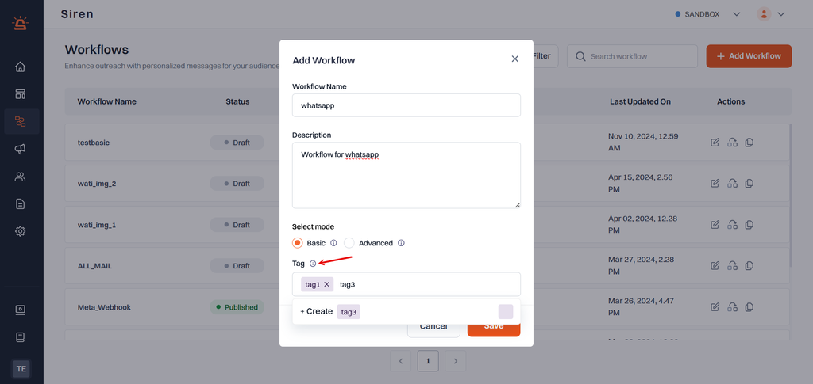
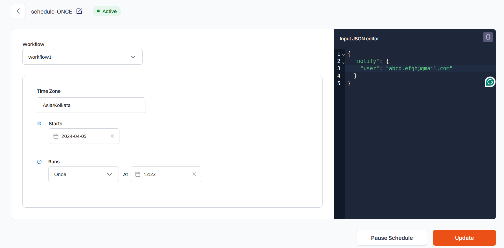

## Tag Workflow

Tags help you categorize workflows for better organization and discovery. By assigning relevant tags during creation, you can easily filter workflows and surface matching templates when building new ones.

### How to Tag Workflows

1. Assign Tags During Workflow Creation

    - Add tags while creating a new workflow.
    - Select from existing tags or create new ones as needed.
    - Apply **multiple tags** to a single workflow for broader categorization.

2. Color-Coded Tags

    - Tags are color-coded for quick visual recognition.
    - Choose from a predefined set of colors, similar to template tagging.

3. Edit Tags Anytime

    After creation, you can:

    - Add or remove tags  
    - Rename tags  
    - Change tag colors  

#### Using Tags to Filter and Search

- **Filter Workflows**: View workflows by filtering based on assigned tags.
- **Search Templates by Tags**: During workflow setup, templates with matching tags will appear first in search results.
- **Clone Tags**: Easily duplicate tags to maintain consistency across workflows.

>**_Note:_** When a **workflow and a template share the same tag**, those templates are automatically prioritized in the template search during workflow creation. This enables smarter, faster setup by narrowing suggestions to only relevant templates.

### Best Practices

- Use consistent tag naming across templates and workflows to fully benefit from automated matching.
- Limit the number of tags per workflow to maintain clarity.
- Reuse tags rather than creating new variations to enable better filtering.

---
## Clone Workflow

With **Clone Workflow**, you can replicate workflows across environments.

### How It Works

1. **Access Workflows Page**  
   Navigate to the Workflows section within Siren.

2. **Select Workflow**  
   Choose the workflow you wish to clone from the list and access the More Options menu (⋮).

3. **Initiate Cloning**  
   Click on "Clone" from the menu. This action prompts the Clone Workflow dialog to appear.

4. **Choose Destination**  
   The name of the workflow remains unchanged. Select the destination environment where you want to clone the workflow.

5. **Dependency Review**  
   Review any dependencies that will be transferred to the chosen environment.

6. **Confirm and Clone**  
   Once satisfied, click "Clone"

---
## Duplicate Workflow

With **Duplicate Workflow**, you can copy an existing workflow within the same environment.

### How It Works

1. **Access Workflows**  
   Navigate to the Workflows section within Siren.

2. **Select Workflow**  
   Choose the workflow you wish to duplicate from the list and access the More Options menu (⋮).

3. **Initiate Duplication**  
   Click on "Duplicate" from the menu. This action prompts the Duplicate Workflow dialog to appear.

4. **Review and Customize**  
   Optionally, review details such as name, description, etc., for the duplicated workflow. Customize as needed before confirming the duplication action.

5. **Confirm Duplication**  
   Proceed by confirming the duplication action.

6. **Utilize Duplicated Workflow**  
   Access the duplicated workflow for further customization or immediate use as needed.

>**_Note:_** Simplify your setup and streamline your workflow within Siren by effortlessly duplicating workflows within the same environment.

---
## Schedule Workflows

Automate the execution of workflows in Siren by scheduling them to run at specific dates and times. This enables efficient task management and ensures timely execution without manual intervention.

### Creating a Schedule

- Click on **Schedules** under **Workflows** in the left navigation pane. you will be navigated to [Schedule Listing]() page.
- Click on the **Add Schedule** button to create a new schedule:
    - Enter a **Schedule Name** when prompted.
    - After saving, you’ll be redirected to the **Schedule Detail Page**.

### Schedule Detail Page

The **Schedule Detail Page** displays all configuration options and metadata for a specific schedule:

- **Schedule Name**: The name assigned to the schedule.
- **Workflow Name**: The workflow to be scheduled should be selected.
- **Start Date and Time Zone**: Set the date/time from which the schedule becomes active and its time zone context.
- **Scheduling Frequency**:  
  Choose how often the workflow should run:  
  - `Once`  
  - `Daily`  
  - `Weekly`  
  - `Monthly`  

- **Schedule Time**: The exact time of day when the workflow should run.
- **End Options**:  
  - `Never`: The schedule continues indefinitely.  
  - `After a specific date`: Define an explicit end date.
- **JSON Body (Optional)**: Input a JSON payload to be passed when the workflow is triggered.
- **Pause and Resume**: Temporarily disable or resume the schedule as needed.

### Schedule Frequencies

#### Once

These schedules execute **only once**, based on the specified configuration.
   - Select **Once** from **Runs** dropdown and you can set when the Schedule should run.

> **_Note:_** Use Once schedules for one-off executions, such as triggering a welcome email or an alert at a specific moment in time.

#### Daily

These schedules run **daily**, starting from the specified start date and time.
- Select **Daily** from **Runs** dropdown and you can select the time of the day and the end date.

> **_Note:_** Use Daily schedules for recurring workflows like daily reports or routine status updates.

#### Weekly

These schedules run **weekly**, starting from the specified start date and time.
- Select **Weekly** from **Runs** dropdown, where you can:
   - Select the days of the week
   - Select the time of the day
   - Select when the schedule should end.

#### Monthly

These schedules run **monthly**, starting from the specified start date and time.
- Select **Monthly** from **Runs** dropdown, where you can:
   - Select the day of the month
   - Select the time of the day
   - Select when the schedule should end.

