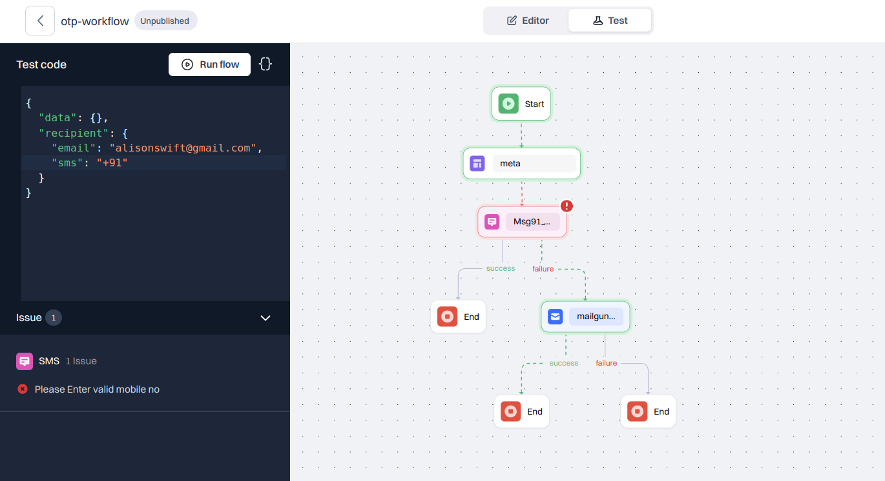
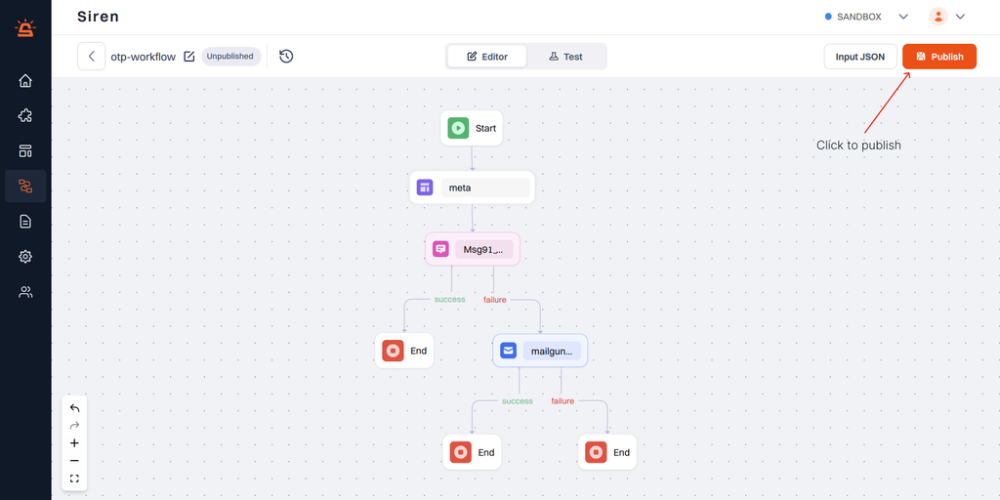

## Test the Workflow

Ensure the seamless execution your workflow by testing it thoroughly. Input JSON data, simulate the workflow run, and validate the outcomes.

Once satisfied, save the test data in Input JSON on the right top panel for future reference.

Once your workflow meets your requirement, seamlessly transition it to the Live environment for real-world deployment by clicking Publish.

### Triggering Workflow Via API

Workflows in Siren can be triggered through APIs:

**Single Trigger**: Run a workflow directly from a Siren dashboard.

**Bulk Trigger**: Send a batch of notifications via bulk triggering.

---
## JSON Inputs

---
## Version Control & Management