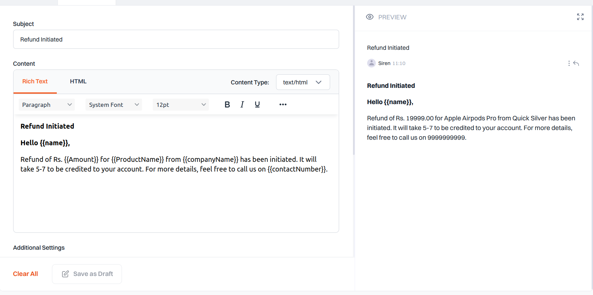

Experience the power of email communication with Siren's versatile template feature.

### How It Works

When selecting **Email**, you gain access to a range of functionalities:

- **Subject:** Begin by adding a subject for your email template, ensuring clarity and relevance.

- **Content Type:** Choose between `"Text/Plain"` or `"Text/HTML"` depending on the content format of your emails.

- **Email Content:** Customize your email content using our Rich Text, HTML, or Plain Text editor, allowing for flexible formatting and design.

- **Attachments:** Seamlessly include dynamic files/attachments within the email by converting them to **base64** if needed, enhancing the richness of your communication.

- **Sender Details:** Specify the **From Name**, serving as the display name for the sender, and define the **From Email**, representing the domain name registered with the provider, ensuring credibility and trustworthiness.

- **Reply-To Address:** Set the **Reply-To** address, directing recipient replies to the designated domain, facilitating seamless communication.

- **CC and BCC:** Optionally add **cc** and **bcc** recipients if necessary, providing a list of email IDs for additional recipients or confidentiality.

- **Preview:** Visualize your email content for a clear representation before sending, ensuring effective communication.

- **Save:** Efficiently store the current state of the channel data for future reference, enabling efficient management and iteration.

> **Note:**  
> To add links in Rich Text, use the **Insert Link** option available in the editor.

