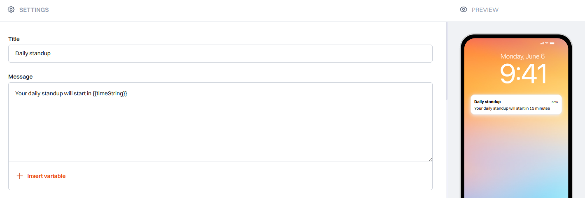

Effortlessly manage push communication with Siren's versatile template feature.

> 💡 **Tip** 
> Use "+ Insert variable" button to add variables in one click.

### How It Works

When selecting **Push**, you gain access to a plethora of customization options:

- **Title:** This optional field provides a concise summary and context for your template.

- **Message:** The body of your template, where the main content resides. This field is mandatory.

### Additional Settings  
Fine-tune your push notification with these advanced options:

- **TTL:** Define a time-to-live duration for collapsible message groups, optimizing delivery efficiency.  
- **Analytics Label:** Associate a label with your message for comprehensive analytics tracking.  
- **Priority:** Control the delivery priority of your message for optimized timing.  
- **Additional Data:** Include supplementary information to enhance user engagement or trigger specific actions.

---

### Platform-Specific Settings

#### Android

- **Image:** Provide a URL for an image to be displayed in the notification.  
- **Destination URL:** Specify the link to direct users when interacting with the notification.  
- **Icon:** Define the icon to be displayed alongside the notification.  
- **Color:** Choose the background color for the notification icon.  
- **Sound:** Set the audio notification for incoming messages.  
- **Badge:** Configure the badge count to display on the app icon.  
- **Tag:** Control the display behavior of notifications with identical IDs.  
- **Ticker:** Define the text displayed in the status bar upon notification arrival.  
- **Collapse Key:** Manage collapsible message groups for streamlined delivery.

#### iOS

- **Image:** Provide a URL for an image to be displayed in the notification.  
- **Subtitle:** Include additional information to provide context within the notification.  
- **Icon:** Define the icon to appear in the notification bar.  
- **Sound:** Specify the sound file for notification alerts.  
- **Badge:** Control the badge count displayed on the app icon.  
- **Collapse Key:** Manage collapsible message groups for optimized delivery.

#### Web

- **Image:** Provide a URL for an image to be displayed in the notification.  
- **Icon:** Define the icon to appear in the notification bar.  
- **Badge:** Control the badge count displayed on the app icon.  
- **Tag:** Control the display behavior of notifications with identical IDs.  
- **Link:** Provide a URL to redirect the user when the notification is clicked.

---

### Final Steps

- **Preview:**  
  Visualize your message layout in the Preview section to ensure effective communication.

- **Save:**  
  Efficiently store the current state of the channel data for future reference and enhancements.

