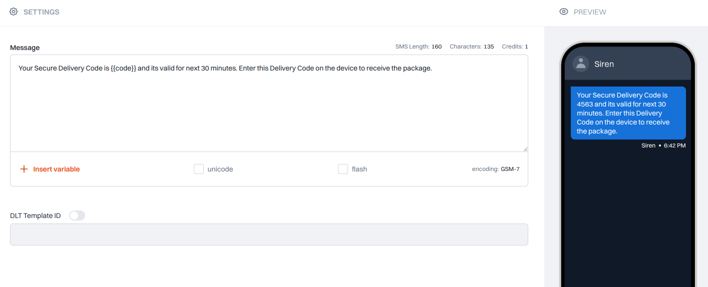

Unlock the simplicity of crafting SMS templates with Siren's innovative feature.

> 💡 **Tip**: Use "+ Insert variable" button to add variables in one click.

## How It Works

When selecting SMS, you gain access to a range of functionalities:

### Message Overview

Get insights into critical message details, such as:

- Encoding type  
- Character count per part  
- Credit usage  

### Message Content

Input your message directly into the SMS template.

### Message Types

Choose from the following types:

- **Text**: Opt for plain text for straightforward messaging.
- **Unicode**: Send messages in multiple languages beyond English.
- **Flash**: Display messages directly on mobile screens for instant viewing.

### DLT Template ID

Seamlessly enter the **DLT template ID** for Indian customers.

### Dynamic Message Personalization

Utilize the **"Insert Variable"** feature to personalize messages dynamically:

- Easily define parameters within placeholders for customized messages.

### Preview

Visualize your message content for a clear representation before sending.

### Save

Efficiently store the current state of the channel data for future reference.

