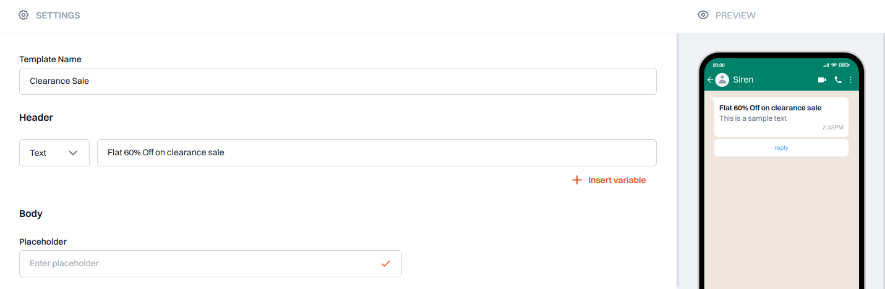

Unleash the power of WhatsApp communication with Siren's adaptable template feature.

## How It Works

When selecting WhatsApp, you gain access to a variety of features:

- **Template Name:** Specify the name of your registered WhatsApp template for easy identification.

- **Header Type:** Choose from Text, Image, Video, or File for the header type.

- **Body Placeholders:** Define placeholders in your template body for personalized messages.

- **Buttons:** Customize buttons for Quick Replies or Click to Action options like Visit Website, Call Phone Number, or Copy Offer Code.

- **Quick Reply:** Assign a unique ID for each Quick Reply, with the option to customize IDs for clarity.

- **Click to Action:** Add actionable buttons such as website links or phone number calls, with support for dynamic or static URLs.

- **Preview:** Visualize your message layout in the Preview section to ensure effective communication.

- **Save:** Efficiently store the current state of the channel data for future reference and improvements.
