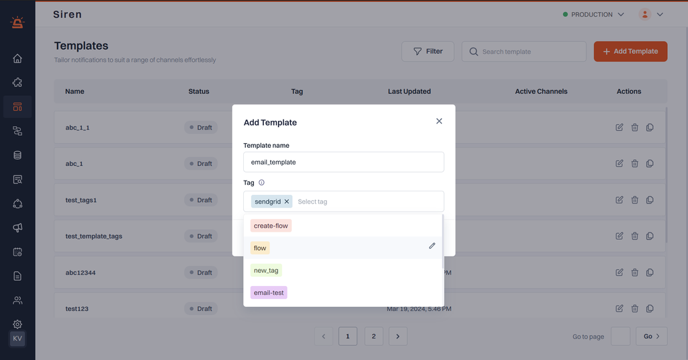

Improve categorization by introducing template tagging for smoother navigation and administration.

## How to Tag Templates:

1. **Create New Template:** Start by creating a new template.

2. **Adding Tags:** While creating the template, you'll encounter a new field for adding tags. Here's how to do it:

    - Choose from existing tags via a dropdown list.
    - Optionally, add new tags to the system. Each tag can have a maximum of 20 characters and must follow alphanumeric character, '-', '_' naming conventions.
    - Assign multiple tags to a single template.

3. **Color Coding:** Tags will be associated with color codes for easy visual identification. Users can choose colors from a predefined set.

4. **Editing Tags:** After template creation, users can edit tags associated with it. They can remove existing tags or add new ones as needed.

5. **Utilize Tags:** Tags will facilitate filtering and viewing of templates based on assigned tags.

### Filtering and Viewing Tags:
- Users can filter templates based on assigned tags.
- Tags can be cloned or duplicated for efficient organization.
