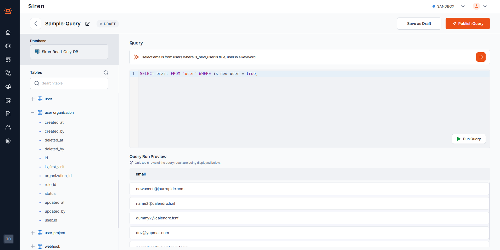

# Creating a Query

:::info Note
Only published queries (i.e., queries with status PUBLISHED) can be used to create cohorts. Ensure you publish your qeuries.
:::

To create a query within a database in Siren, follow these steps:

1. **Select a Database**: Navigate to the Database dashboard and click on the desired database data source. A new window will appear displaying the account details and a list of existing queries for that database.
2. **Create a New Query**: On the top right, click the "Create Query" button. This action will open a new window.

3. **Explore Database Tables**: On the left side of the new window, you will see all the tables associated with the selected database. You can expand each table to view its fields.
4. **Generate or Write Your Query**
   - AI Assistance: Type in your requirements in plain text and make use of AI to generate your SQL query.
   - Manual Entry: Alternatively, you can directly type the SQL query in the "Type Query" field.
5. **Run the Query**: After typing your query, click on the "Run Query" button. Your query will be executed, and the results will be displayed under the Query Run Preview section.
6. **Publish the Query**: Once you are satisfied with the query results, you can either save it as a draft or publish your query.

This process allows you to easily interact with your database, generate queries, and view results directly within Siren.
