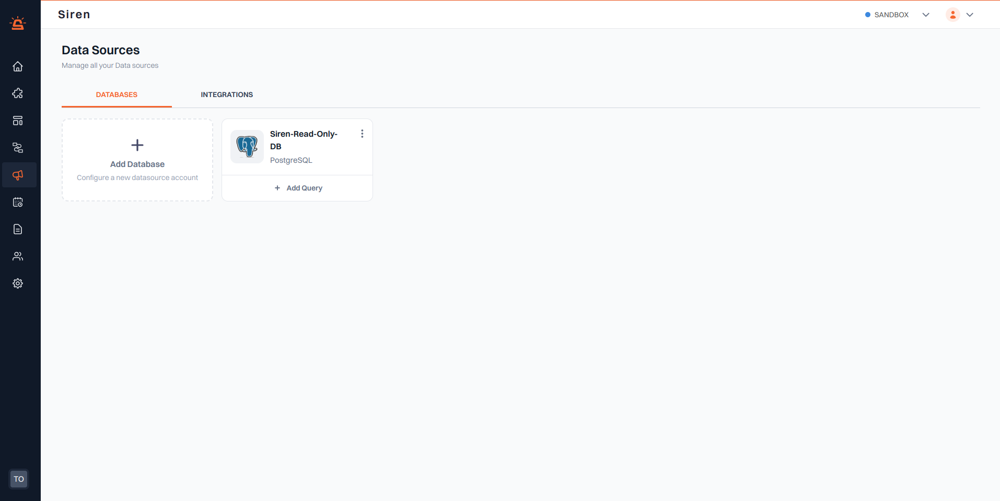
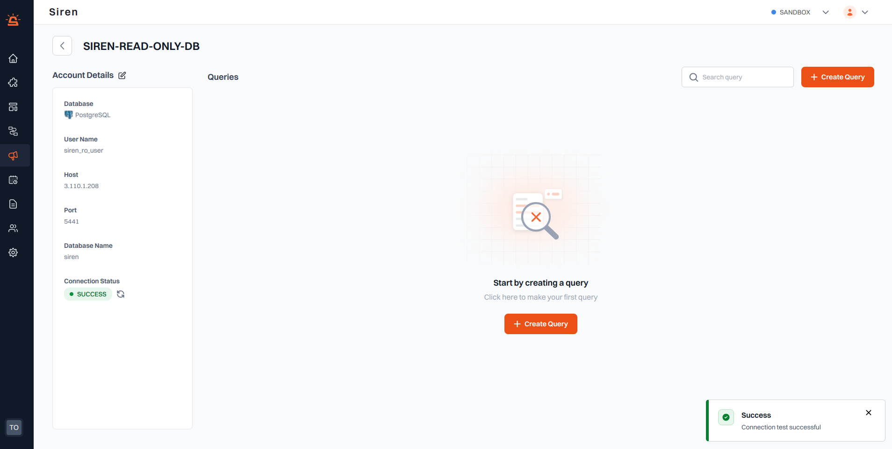

# PostgreSQL

:::info Prerequisite
Ensure you have a PostgreSQL database already set up.
:::

To connect your PostgreSQL database with Siren, follow these steps:

1. **Access Datasource**: Navigate to the Campaigns section in your Siren dashboard and choose Datasource from the drop-down.

2. **Add Database**: Choose “Databases” from available datasource options and click on "Add Database".

3. **Enter Database Details**: A pop-up window will appear. Fill in the required information:

   - _Database_ : Select your database type as PostgreSQL from the dropdown.
   - _Name_ : A descriptive name for your data source (e.g., "My DataSource").
   - _Host_ : The host address of your PostgreSQL database (e.g., "0.0.0.0").
   - _Port_ : The port number for your PostgreSQL database (e.g., "5432").
   - _Username_ : The username for accessing your PostgreSQL database.
   - _Password_ : The password for accessing your PostgreSQL database.
   - _Database Name_ : The name of your PostgreSQL database.
   - _Additional Settings_ : Optional SSL settings, including SSL root certificate and SSL client certificate, can also be configured for secure connections.

4. **Save Database**: Click on "Save" to save your database. Your newly added PostgreSQL database will now show up in the Database dashboard. Click on your database and a new screen will appear displaying the entered details.

5. **Check Connection Status**: Under “Connection Status”, you will see a status indicator. The default status is "Unverified". Use the "Refresh" icon to ensure the database connection is successful. Upon successful connection, the status changes to “Success”.

:::tip Tip
If the connection status shows "Failure", recheck the filled-in information for accuracy and re-attempt to refresh the connection status.
:::
