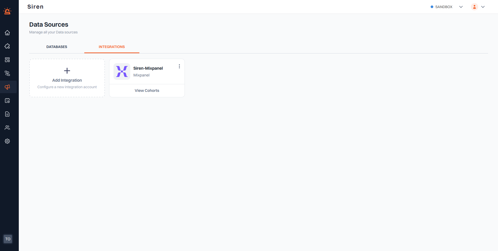
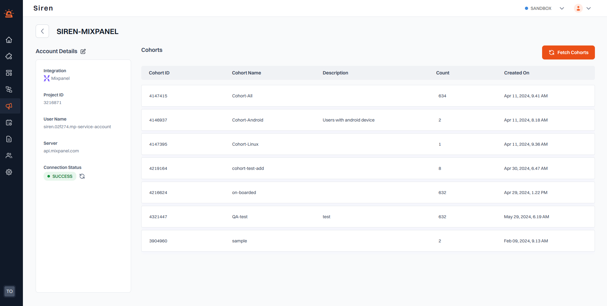

# Mixpanel

:::info Prerequisite
Ensure you have a Project and a Service Account already set up in Mixpanel.
:::

To connect your Mixpanel account with Siren, follow these steps:

1. **Access Integration**: Navigate to the Campaigns section in your Siren dashboard and choose Integration from the drop-down.

2. **Add Integration**: Choose “Integrations” from available datasource options and click on "Add Integration".

3. **Enter Integration Details**: A pop-up window will appear. Fill in the required information:

   - _Integration_ : Select Mixpanel from the dropdown.
   - _Name_ : A descriptive name for your data source (e.g., "My DataSource").
   - _Project ID_ : Enter your Mixpanel Project ID.
   - _Username_ : Enter your Mixpanel username.
   - _Password_ : Enter your Mixpanel password.
   - _Server_ : Enter the Mixpanel server address.

4. **Save Integration**: Click on "Save" to save your database. Your newly added database will now show up in the Database dashboard. Click on your database and a new screen will appear displaying the entered details.

5. **Check Connection Status**: Under “Connection Status”, you will see a status indicator. The default status is "Unverified". Use the "Refresh" icon to ensure the database connection is successful. Upon successful connection, the status changes to “Success”.

:::tip Tip
If the connection status shows "Failure", recheck the filled-in information for accuracy and re-attempt to refresh the connection status.
:::
