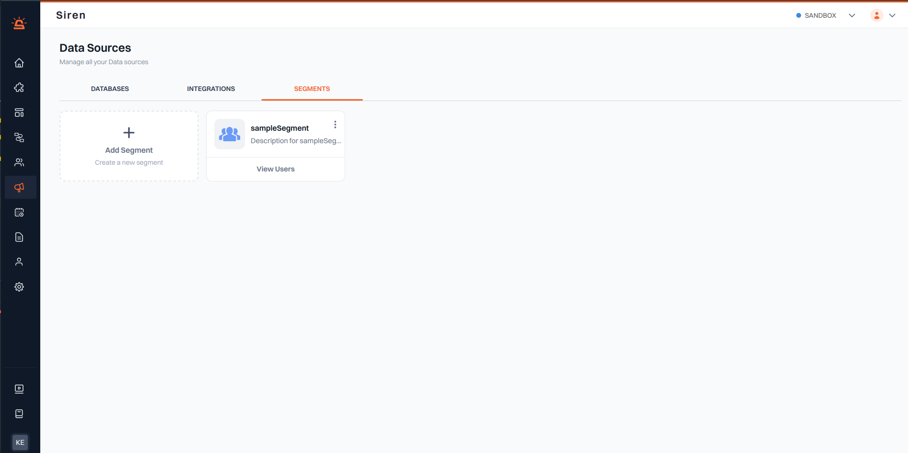
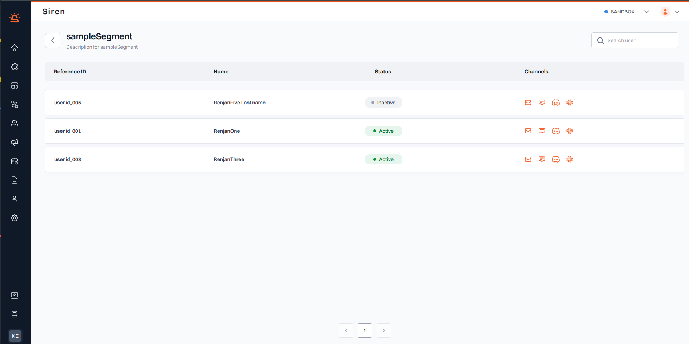

# Segments

The **Segments** section allows you to create and manage dynamic groups of users for targeted notification campaigns.

### Overview

- **Segments**: View all created segments along with their details. You can easily manage them with options to edit or delete.
- **Add Segment**: Use the "Add Segment" button to create a new user segment by uploading a CSV file that contains the corresponding user details.

---

## Managing Segments

Once a segment is created, you can view it on the main segments page. Clicking on a specific segment will display the associated users along with their details.

### Segment Details

- **Associated Users**: Displays all users linked to the selected segment.
- **Search Options**: Use the search bar to quickly find users within the segment.
