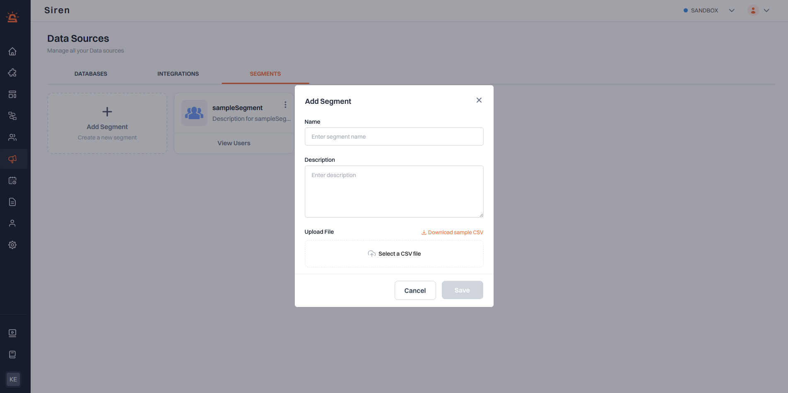

# Adding a Segment

Clicking the **Add Segment** button opens a dialog that allows you to upload a CSV file containing user details. Ensure the CSV is properly formatted to include necessary information for segment creation.

---

## Steps to Upload a CSV:

1. Click the **Add Segment** button.
2. Select the CSV file from your device that contains the user data.
3. Ensure the file includes required fields corresponding to user details.
4. Click "Submit" to process the upload and create the new segment.
