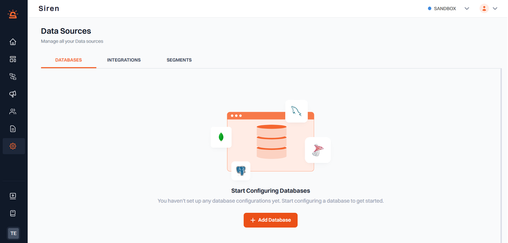

# Data Sources - Overview

Data sources are central to defining user cohorts for targeted notifications in Siren. They allow you to manage and organize user data effectively, ensuring precise targeting for your campaigns.

---

## Navigating to Data Sources

From the left sidebar, go to **Settings > Data Sources** to manage all your data sources.

## Types of Data Sources

Siren supports three types of data sources:

### 1. Databases

The **Database** data source in Siren enables a direct connection to your database, allowing you to use stored user data for creating targeted cohorts.

#### Supported Databases:

- **PostgreSQL**
- **Redshift**
- **Snowflake**
- **BigQuery**
- **MySQL**

By integrating with your database, you can access and use existing user data seamlessly for your notification campaigns.

---

### 2. Integrations

With **Integrations**, Siren connects to analytics platforms like Mixpanel, enabling you to access detailed user data and predefined cohorts.

#### Benefits:

- Leverages behavioral and demographic data from third-party platforms.
- Streamlines the process of targeting highly specific user groups.

> **Example**: Use Mixpanel data to target users based on their actions, such as completing a purchase or visiting specific pages.

---

### 3. Segments

**Segments** are flexible groups of users defined within Siren based on behavior, attributes, or other criteria. Siren provides two ways to create segments:

#### Methods to Create Segments:

1. **Directly in Siren**:

   - Define user groups based on custom criteria directly within the platform.

2. **CSV Upload**:
   - Upload a CSV file containing user details to quickly create a segment.
   - This allows you to import user lists and define cohorts based on your external data.

> **Tip**: CSV uploads are perfect for one-time campaigns or when using data that isn’t stored in your integrated databases.

---

## Why Use Data Sources?

By utilizing these data source options, you can:

- Define accurate user cohorts.
- Enhance the precision and reach of your campaigns.
- Optimize user engagement by targeting the right audience with the right message.

> Ready to get started? Navigate to **Settings > Data Sources** to configure your data sources today.
