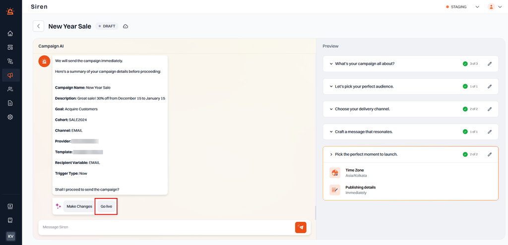

# Getting Started with Campaigns in Siren

Siren’s Campaign feature leverages AI to create personalized message templates, selecting the ideal channel, timing, and scheduling based on your needs. The AI Campaign engages in an interactive chat to understand your campaign’s goals, audience, and messaging requirements, then recommends tailored templates and optimal time slots to maximize engagement.

---

## Key Benefits

- **Campaign Co-Pilot**: Build and customize campaigns with simple instructions in a conversational format powered by ChatGPT-4.0.
- **AI-Powered Content Personalization**: Generate tailored content with integrated AI.
- **Minimal Technical Effort**: Launch campaigns quickly without coding skills.
- **Mass Communication**: Send large-scale notifications efficiently.
- **Automated Scheduling**: “Set it and forget it” for stress-free campaign management.
- **In-Depth Analytics**: Track campaign performance through the Campaign Dashboard.
- **Test and Refine**: Test campaigns before going live and adjust as needed.

---

## Prerequisites

1. **Provider Integration**: Ensure providers are integrated for each channel (SMS, Email, Push Notifications, etc.) you plan to use.
2. **Data Sources**: Set up Data Sources to fetch the Campaign audience.

---

## Setting Up a Campaign

1. Navigate to **Campaigns** from the left navigation panel and select **My Campaigns**.
2. Click **+ Create Campaign**.

Answer the setup questions provided by Campaign AI to help generate the ideal message template.

### 1. Campaign Setup

- **Campaign Name**: Enter a unique name for easy identification.
- **Description**: Briefly describe the campaign’s purpose or content.
- **Main Goal**: Define the primary goal (e.g., customer engagement, feature announcement).
- **Select Cohort**: Specify the target audience for the campaign. Choose an existing Cohort or create a new one.

---

### 2. Creating a New Cohort

1. Click **Add New Cohort** and enter:
   - **Cohort Name**: Name for the cohort.
   - **Description**: Brief description of the cohort’s criteria.
   - **Data Source**: Select the Data Source (Database, Integration, or Segment).
2. Click **Fetch Details** to preview the cohort.

---

### 3. Configuring Campaign Details

1. **Select Communication Channel**: Choose from SMS, Email, etc.
2. **Select Provider**: Choose a provider from the integrated options.
3. **Message Templates**: Siren suggests AI-generated templates based on your inputs:
   - Choose a suggested template.
   - Edit a suggested template.
   - Create a new template from scratch.
   - Import a previously created template.
4. **Map Variables**: Select the column in the recipient schema containing the audience data.

---

### 4. Scheduling and Frequency

1. **Set Timing**: Send immediately or schedule for a later date.

2. **Choose Frequency**:
   - **Once** or **Recurring**.
   - For recurring campaigns, specify:
     - **Start and End Dates**.
     - **Time Zone**.
     - **Frequency** (e.g., daily, weekly, monthly).
     - **Specific Day and Time**.

---

### 5. Test and Launch

1. Test the campaign with a sample audience.
2. Make necessary adjustments.
3. Launch the campaign when ready.

---

## Campaign Dashboard

Once live, monitor the campaign’s performance via the **Campaign Dashboard**. Analyze metrics like:

- Notifications sent and delivered.
- Engagement rates and failures.
