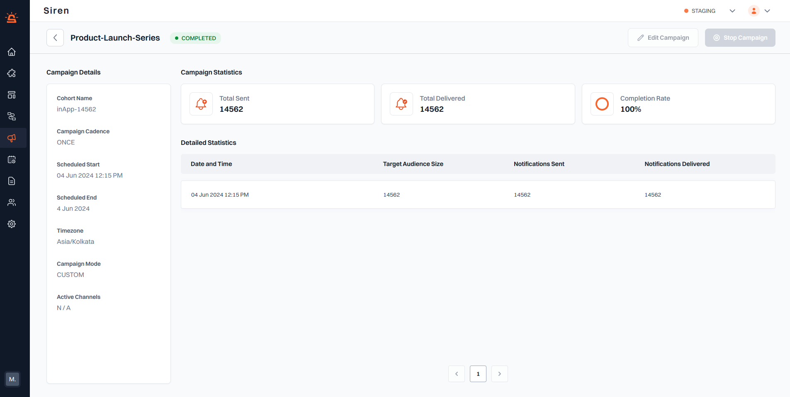

# Campaign Details and Statistics

To access the campaign details and statistics page, follow these steps:

1. **Navigate to the Campaign List**: Go to the My Campaigns section in your Siren dashboard.
2. **Select a Campaign**: Click on the campaign for which you want to view the details statistics.

This action will take you to the campaign's detailed statistics page.

## Campaign Actions

- **Edit Campaign**: Option to modify the campaign settings.
- **Stop Campaign**: Option to stop the campaign from running.

:::info Note

- Only campaigns with status DRAFT or SCHEDULED can be edited.
- A STOPPED campaign cannot be reactivated or resumed.
  :::

## Campaign Details

On the left side of this page, you will find the campaign details section with information about your campaign setup and configuration, such as cohort name, campaign cadence, scheduled start and end of the campaign, and more.

## Campaign Statistics

The campaign details section provides key performance metrics for the campaign:

1. **Total Sent**: The total number of notifications sent by the campaign.
2. **Total Delivered**: The total number of notifications successfully delivered.
3. **Completion Rate**: The percentage of notifications delivered out of the total sent.

## Detailed Statistics

A detailed breakdown of the campaign's performance for **each scheduled campaign execution**:

1. **Date and Time**: The date and time when the notifications were sent.
2. **Target Audience Size**: The size of the target audience for that particular notification.
3. **Notifications Sent**: The number of notifications sent to the target audience.
4. **Notifications Delivered**: The number of notifications successfully delivered.
