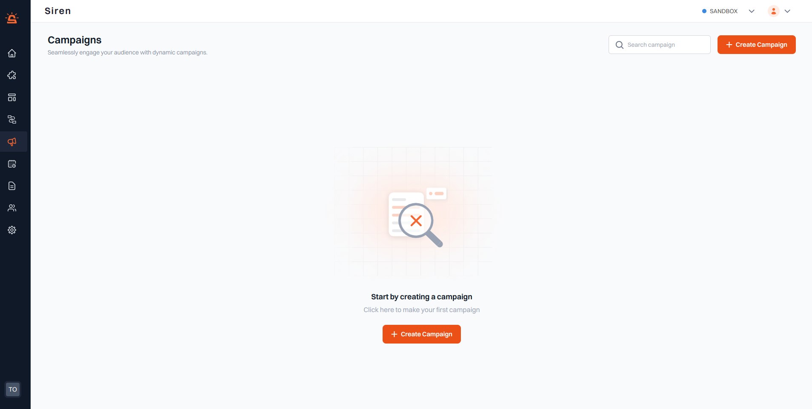
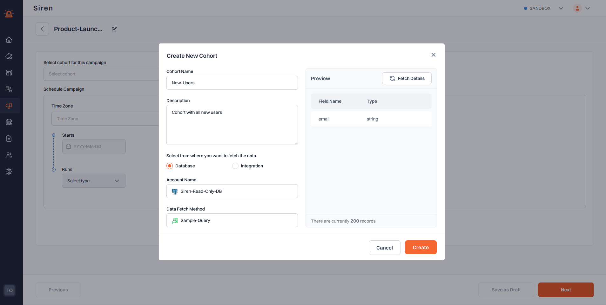
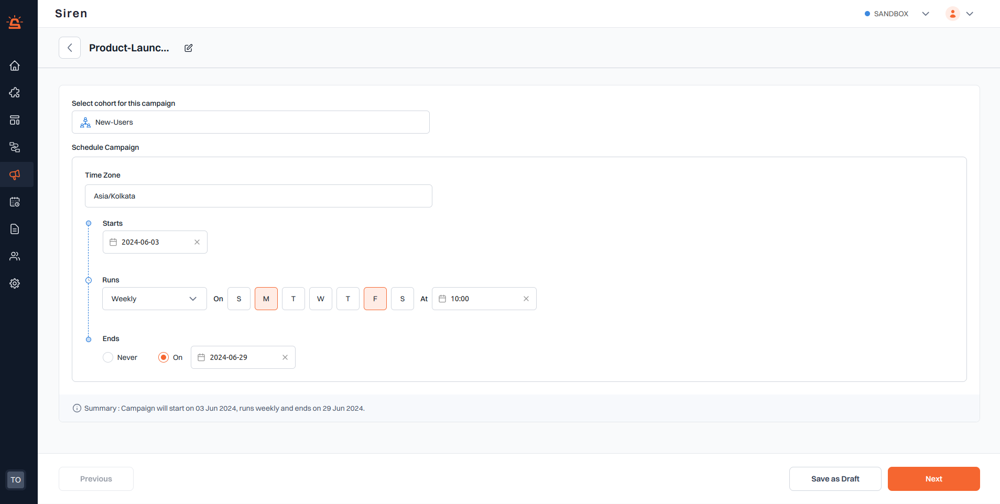
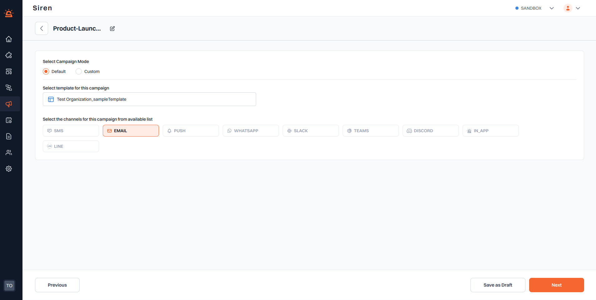
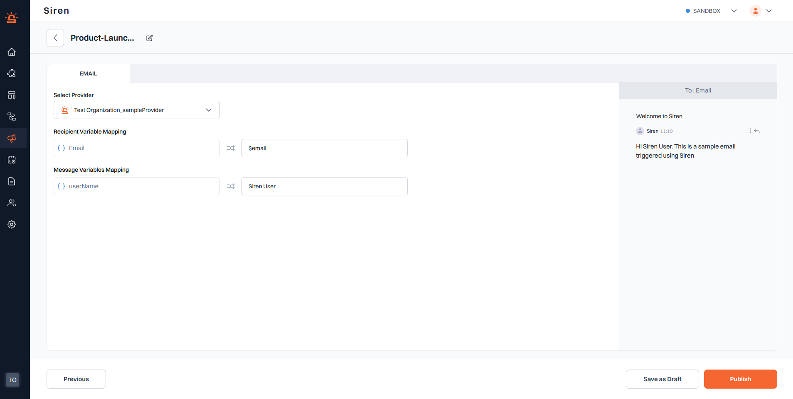
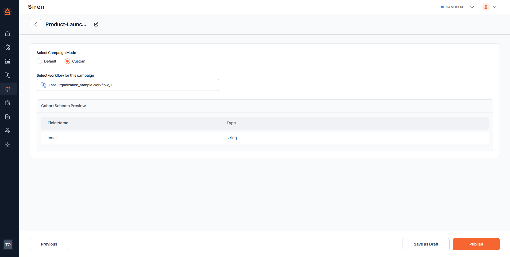

# Creating a Campaign

:::info Note

- Ensure you **Publish** your campaign once all details are correctly entered.
  :::

To get started with creating a campaign, follow these steps:

1. **Navigate to My Campaigns**: Navigate to the Campaigns section in your Siren dashboard and click the “My Campaigns” from the drop-down.
2. **Create new Campaign**: Click the "+Create Campaign" button.
3. **Name your Campaign**: A pop-up window will appear asking you to provide a name for your campaign.
4. **Save Your Campaign**: After naming your campaign, click on the "Save" button to confirm your selection.

After saving, a new page will appear prompting you to select a cohort for the campaign.

### Set Cohort

From the “Select cohort for this campaign” drop-down, you can either choose a relevant cohort that has already been created by you or choose to create a new cohort using the “+Create Cohort” button.

When clicked on the “+Create Cohort” button, a pop-up window will appear. You can define your cohort by the following steps.

1. **Cohort Name**: Enter a name for your cohort (e.g., "Active-Users").
2. **Description**: Add a description to provide context or details about the cohort (e.g., "Users active in the last 30 days").
3. **Select Datasource Type**: Choose from where you want to fetch the data:
   - Database: For cohorts based on data from a database.
   - Integration: For cohorts based on data from an integrated data analytics platform such as Mixpanel.
4. **Account Name**: Select the account from which to fetch the data.
5. **Data Fetch Method**: Specify how to fetch the data. The method will vary depending on the data source type:
   - For Database: Saved queries associated with the selected database will show up. Choose the required desired from the drop-down list.
   - For Integration: Cohorts associated with the selected inetgration account will show up. Choose the desired cohort from the drop-down list.
6. **Preview**: Once filled in the above fields, the “Fetch Details” button will fetch the schema associated with the query/cohort.

### Schedule Campaign

1. **Time Zone**: Select the time zone for scheduling the campaign (e.g., Asia/Kolkata).
2. **Start Date**: Set the start date for the campaign (e.g., 2024-05-28).
3. **Frequency**: Choose how often the campaign runs.
   - **Once**: For a one-time notification.
   - **Daily**: For daily notifications.Monthly: For monthly notifications.
   - **Weekly**: For weekly notifications. Choose days (Sunday to Saturday) from the options.
   - **Monthly**: For monthly notifications. Choose from First day, Last day or any custom day of the month.

:::info Note

- For any given frequency, you should set the exact time for the notification to be sent (e.g., 21:47).
- For Daily, Weekly and Monthly campaigns, you can either choose “ends” to be never for a never-ending campaign or give a fixed date till when the campaign needs to run.
  :::

### Select Campaign Mode

After setting a cohort and scheduling your campaign, select the campaign mode and configure the notification channels. You can choose between two modes:

- **Default**: Use pre-configured templates for your campaign.
- **Custom**: Use pre-configured workflows for your campaign.

1. **Default**

- _Select Template_ : Select a template from the drop-down list and once selected, the available channels associated with the template will be highlighted. Choose one from the available channels. You can either choose to save as draft to come back later or click on next to complete the flow.

- _Select Provider_ : Choose the provider you want to use for sending notifications from the drop-down.
- _Recipient Variables Mapping_ : Connect the cohort data fields to the recipient variables required by the provider.
- _Message Variables Mapping_ : Connect the cohort data fields to the message variables required by the template.

:::info Note
For Variables Mapping, you can also opt to type/hard-code the value instead of choosing a data field.
:::

2. **Custom**: Use pre-configured workflows for your campaign. The schema preview of the cohort associated with the current campaign will be displayed under “Cohort Schema Preview”

By following these steps, you can effectively select a provider and map the necessary variables using templates or directly use a workflow, ensuring that your campaign notifications are sent to the right recipients with the correct information.
