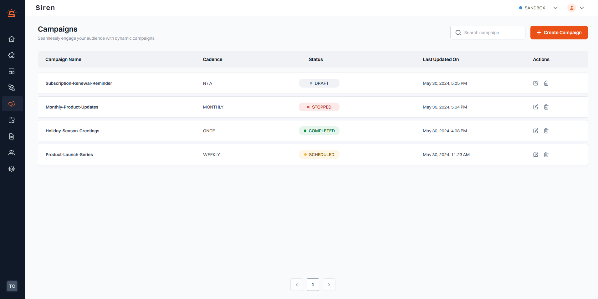

# Campaign Statuses

:::info Note

- Only campaigns with status DRAFT or SCHEDULED can be edited.
- A STOPPED campaign cannot be reactivated or resumed.
  :::

Understanding the statuses of your campaigns helps you manage and monitor their progress effectively. Here are the different statuses a campaign can have, along with examples to illustrate each:

1. **Draft**: The campaign has been created but hasn't been published. Data may be incomplete.

   - You've started setting up a recurring campaign named "Product Launch Series" to announce new features every Monday and Friday but haven't finalized the cohort or scheduled the notifications. The status remains as DRAFT until you publish it.

2. **Scheduled**: The campaign has been published but the start date hasn't been reached yet.

   - You've completed setting up and published the "Product Launch Series" campaign today to start sending updates every Monday and Friday. Today is Wednesday, so the status is SCHEDULED until the next start date, which is Friday.

3. **Active**: The start date has arrived, but the start time or execution hasn't begun yet.

   - It's now Friday, the start date for your "Product Launch Series" campaign, but the scheduled time for sending notifications is 10:00 AM and it's currently 9:00 AM. The status is ACTIVE until the next occurrence begins.

4. **Running**: The campaign execution has started.

   - It’s now 10:00 AM on Sunday, and your "Product Launch Series" campaign has completed one execution on last Friday, but more occurrences are still scheduled. The status is RUNNING for the current occurrence.

5. **Stopped**: The campaign has been stopped by the user.
   - After starting the "Product Launch Series" campaign, you decide to halt the notifications due to an error in the message content. You manually stop the campaign, changing its status to STOPPED.
6. **Completed**: All executions of the campaign have been completed.
   - The "Product Launch Series" campaign has finished sending all scheduled notifications for the given duration. The process for the all occurrences is fully completed, so the status is marked as COMPLETED.

These statuses help you track the lifecycle of your campaigns and ensure that each stage is progressing as intended.
