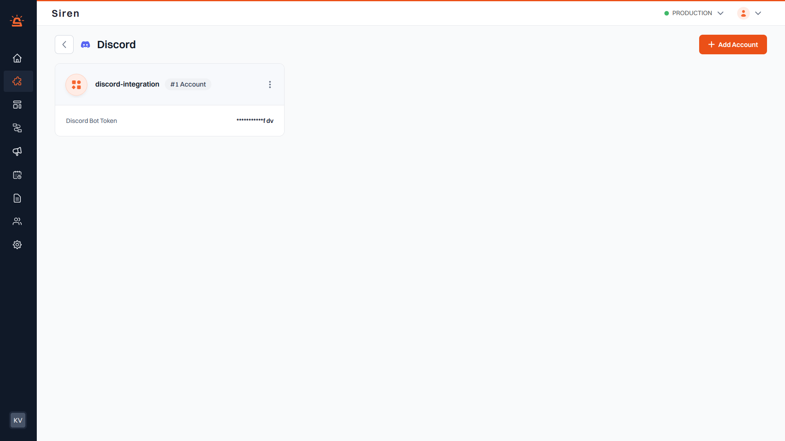
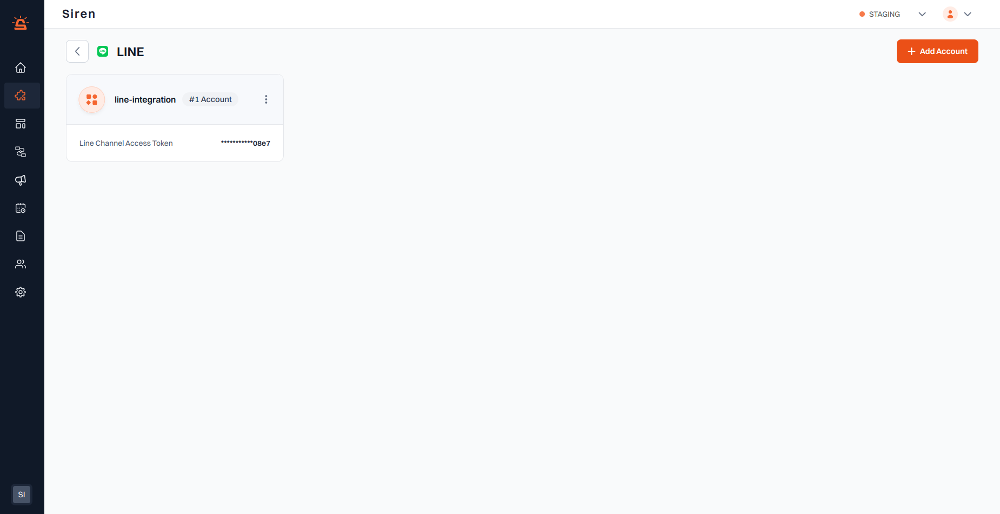
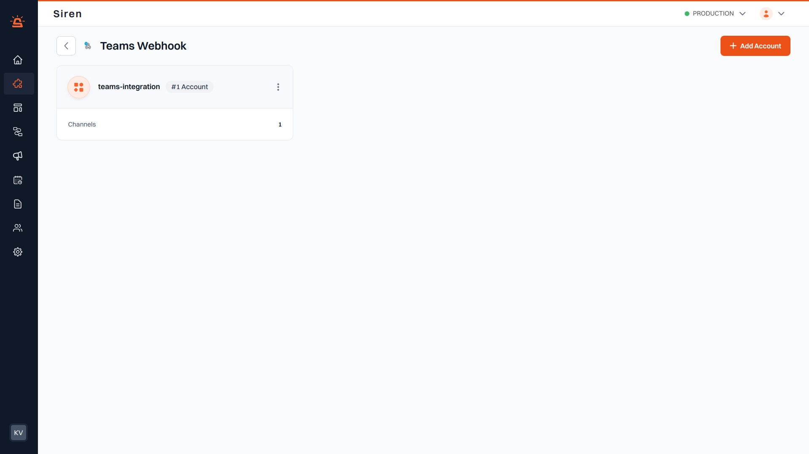

## Discord Integration

**_Prerequisite:_**
Ensure you have an existing Discord account.

---
#### Integration Setup
To integrate your Discord account with Siren, follow these steps:

1. **Navigate to Providers**: Access the Providers section in your Siren dashboard.  
2. **Select Chat Channel**: Choose the Chat channel.  
3. **Choose Discord**: Locate Discord in the list of providers and click on **"Add Account"**.  
4. **Fill in Account Details**: A pop-up window will appear. Enter the following:
    - **Custom Name**: Provide a name for easy identification within Siren's interface.  
    - **Discord Bot Token**: Enter the bot token obtained from your Discord developer portal.  
5. **Save Configuration**: Click **"Save"** to save your Discord account configuration.

By following these steps, you can seamlessly integrate your Discord account with Siren for effective communication.

---

## Line Integration

**_Prerequisite:_**
Ensure you have an existing Line account.

#### Integration Setup
To integrate your Line account with Siren, follow these steps:

1. **Navigate to Providers**: Access the Providers section in your Siren dashboard.  
2. **Select Chat Channel**: Choose the **Chat** channel.  
3. **Choose Line**: Locate **Line** in the list of providers and click on **"Add Account"**.  
4. **Fill in Account Details**: A pop-up window will appear. Enter the following:
   - **Custom Name**: Provide a name for easy identification within Siren's interface.  
   - **Line Channel Access Token**: Enter the access token received from your Line account.  
5. **Save Configuration**: Click **"Save"** to save your Line account configuration.

By following these steps, you can seamlessly integrate your Line account with Siren for effective communication.

---

## Slack Integration

**_Prerequisite:_** Ensure you have an existing Slack account. 

### Before you begin

Before proceeding with the Slack integration, ensure that Slack App is properly configured. Refer to [Slack App Configuration Guide](../../../06%20-%20Configurations/Slack-app-configuration.md) to complete the setup.

#### Integration Setup
To integrate your Slack account with Siren, follow these steps:

1. **Navigate to Providers**: Access the Providers section in your Siren dashboard.  
2. **Select Chat Channel**: Choose the **Chat** channel.  
3. **Choose Slack**: Locate **Slack** in the list of providers and click on **"Add Account"**.  
4. **Fill in Account Details**: A pop-up window will appear. Enter the following:
   - **Custom Name**: Provide a name for easy identification within Siren's interface.  
   - **Slack App Token**: Enter the app token obtained from your Slack API dashboard.  
5. **Save Configuration**: Click **"Save"** to save your Slack account configuration.

By following these steps, you can seamlessly integrate your Slack account with Siren for effective communication.

---

## Teams Webhook Integration

**_Prerequisite:_**
Ensure you have an existing Microsoft Teams account with Webhook access.

#### Integration Setup
To integrate your Teams Webhook account with Siren, follow these steps:

1. **Navigate to Providers**: Access the Providers section in your Siren dashboard.  
2. **Select Chat Channel**: Choose the **Chat** channel.  
3. **Choose Teams Webhook**: Locate **Teams Webhook** in the list of providers and click on **"Add Account"**.  
4. **Fill in Account Details**: A pop-up window will appear. Enter the following:
   - **Custom Name**: Provide a name for easy identification within Siren's interface.  
   - **Channels**: Create dedicated sections within your team to keep conversations organized by specific topics, projects, or disciplines. You can add multiple channels for an account.  
     - **Channel ID**: Enter the channel ID retrieved from the link obtained via *"Get link to channel"* in the channel's options menu. You can find the channel ID after the `/channel` path in the link.  
     - **Webhook URL**: Enter the webhook URL obtained from your Teams channel settings.  
5. **Save Configuration**: Click **"Save"** to save your Teams Webhook account configuration.

By following these steps, you can seamlessly integrate your Teams Webhook account with Siren for effective communication.
