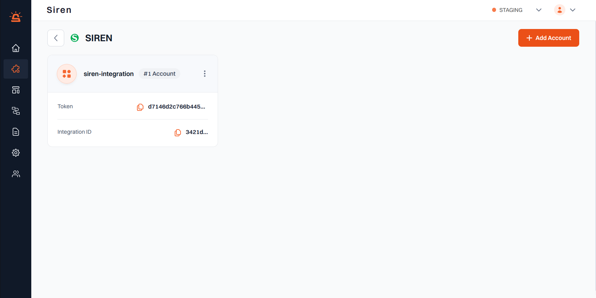

## Siren Integration

#### Before You Begin

> **Note:**  
> You can only configure up to 5 account credentials within In-App.

#### Integration Setup

To seamlessly integrate Siren with your In-App channel, follow these straightforward steps:

1. **Access Providers**: Head to the **Providers** section in your dashboard.

2. **Choose In-App Channel**: Select the **In-App** channel from the available options.

3. **Select Siren**: From the list of providers, pick **Siren**, and hit **Add Account**.

4. **Enter Account Details**: In the ensuing pop-up window, furnish the necessary information:
   - **Custom Name**: Assign a distinctive name for easy identification within Siren's interface.

5. **Save**: Click **Save** to confirm and store your configuration.

6. **Connect Your System**: Utilize the **provided token** and **Integration ID** to establish the connection between your system and Siren.

---

Following these steps ensures a seamless setup of your Siren integration for the In-App channel, enabling efficient communication with your users.
