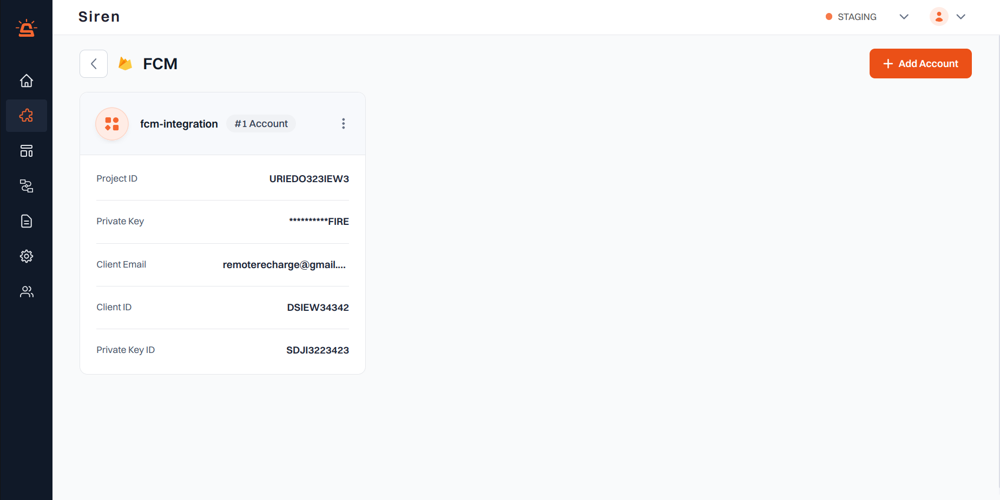
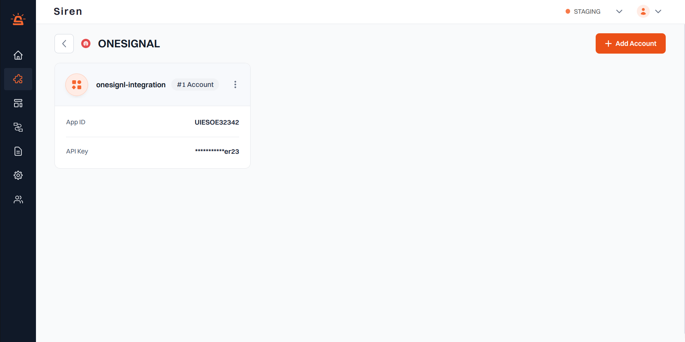

## FCM Integration

**_Prerequisite:_**
Ensure you have an account already set up in **Firebase Cloud Messaging (FCM)** with an app built (SDK) within FCM.

#### Integration Setup

To integrate your FCM account with Siren, follow these steps:

1. **Navigate to Providers**: Go to the **Providers** section in your Siren dashboard.

2. **Select Push Channel**: Choose the **Push** channel.

3. **Choose FCM**: Locate **FCM** in the list of providers and click on **"Add Account"**.

4. **Fill in Account Details**: A pop-up window will appear. Enter the following details:

  - **Custom Name**: Provide a name for easy identification within Siren's interface.
  - **Firebase Project ID**: Log into your Firebase (FCM) panel and find the app you would like to connect to.  
    - On the **Project Overview** tab in the left navigation panel, find the **Settings** icon and select **Project Settings**.  
    - On the page that opens, in the ribbon menu, find **Service Accounts** and click on **Generate New Private Key**.  
      If you cannot see this option, you may first need to "Create a new Service Account".  
    - Once downloaded, open the file — it will contain the **"project_id"**.
  - **Private Key**: Found in the same file as above.
  - **Client Email**: Found in the same file as above.
  - **Client ID**: Found in the same file as above.
  - **Private Key ID**: Found in the same file as above.

5. **Save Configuration**: Click on **Save** to save your FCM account configuration.

By following these steps, you can seamlessly integrate your FCM account with Siren for effective push communication.

---

## OneSignal Integration

**_Prerequisite:_**
Ensure you have an account already set up in **OneSignal** with an app built (SDK) within FCM.

#### Integration Setup

To integrate your OneSignal account with Siren, follow these steps:

1. **Navigate to Providers**: Go to the **Providers** section in your Siren dashboard.

2. **Select Push Channel**: Choose the **Push** channel.

3. **Choose OneSignal as the Provider**: Locate **OneSignal** in the list of providers and click on **"Add Account"**.

4. **Fill in Account Details**: A pop-up window will appear. Enter the following details:

  - **Custom Name**: Provide a name for easy identification within Siren's interface.
  - **App ID**: From your OneSignal application, navigate to the **Settings** option in the ribbon menu and find **"Keys & IDs"** in the secondary ribbon. Enter the **App ID**.
  - **API Key**: From the same **Keys & IDs** section, enter the **REST API Key**.

5. **Save Configuration**: Click on **"Save"** to save your OneSignal account configuration.

By following these steps, you can seamlessly integrate your OneSignal account with Siren for effective push communication.
