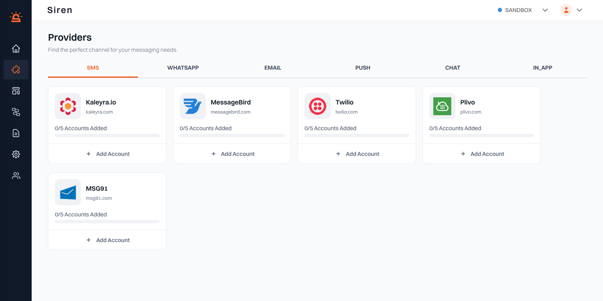

Siren streamlines the integration process, ensuring a hassle-free setup experience through the following steps:

---

## Choose a Channel

Not every audience engages the same way — and that's why Siren offers options.  
Whether it's Email, SMS, Push, or more, channels can be selected based on what works best for your target audience.

The following sections walk through how to set up each channel.  
No complex setup — just clean, flexible integration that fits seamlessly into any product.

---

## Select a Provider

Providers are the backbone of your communication infrastructure, offering essential services for sending messages and notifications.

With Siren, you have the flexibility to work with multiple providers based on your business requirements and preferences.

Our platform seamlessly integrates with various providers, allowing you to add them effortlessly to your account.  
Providers are categorized under their respective channels for easy access and management.

> **_NOTE:_**  Each provider can have a maximum of 5 accounts across all channels. If your preferred provider is not listed, feel free to reach out to our support team for assistance.