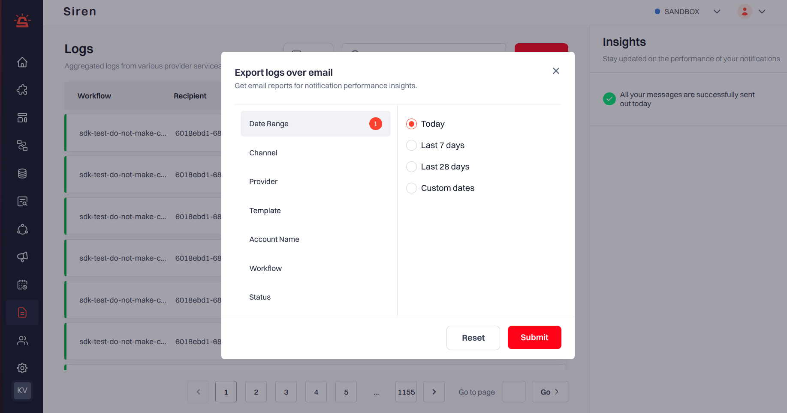

Users now have the ability to export logs as **.csv files**. This functionality is accessible by clicking on the export button, positioned after the search field.

## Export Process

1. **Access Logs Page:** Navigate to the Logs section within Siren.

2. **Click Export:** Users can click on the export button located next to the search field.

3. **Apply Filters:** Users can apply filters such as Date Range, Channel, Provider, Template, Account Name, Workflow, and Status to refine the logs.

4. **Initiate Export:** Users can initiate the export process by clicking the submit button.

5. **Email Notification:** Users will receive an email containing the link to download the exported file, which is valid for 30 days.

6. **Download File:** Upon clicking the download link in the email, the file will automatically download to the user's system.

This streamlined process allows users to easily export logs as .csv files and access them conveniently via email with a downloadable link.